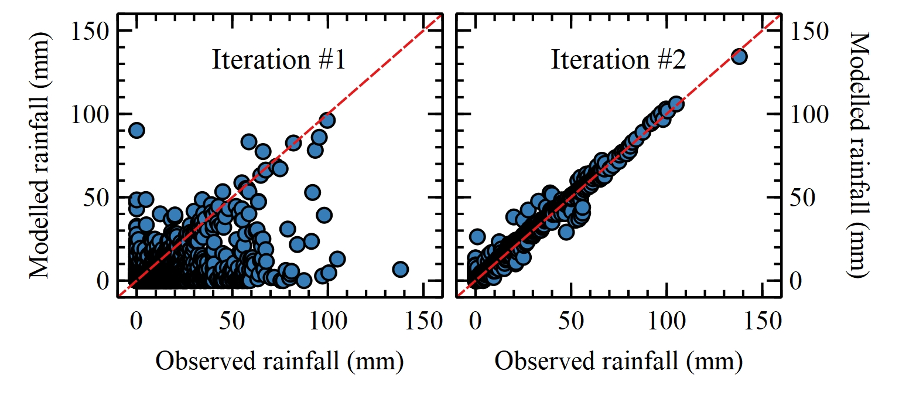

# CGF4S - Climate gap filler for SWAT
###### *Rodrigo de Queiroga Miranda, Josiclêda Domiciano Galvíncio*
###### Contact: rodrigo.qmiranda@gmail.com

### About
CGF4S is a work in progress to create an algorithm capable of filling large gaps in spatial climate datasets to be used in SWAT models. It is still in the Alpha phase, but is already showing promissing results. It uses the Cubist library to iteratively fill gaps in all kind of climate data formatted as inputs of the SWAT model. The scripts are being developed for the interpreter R 3.6.3.

### Development status

### Preliminary results
